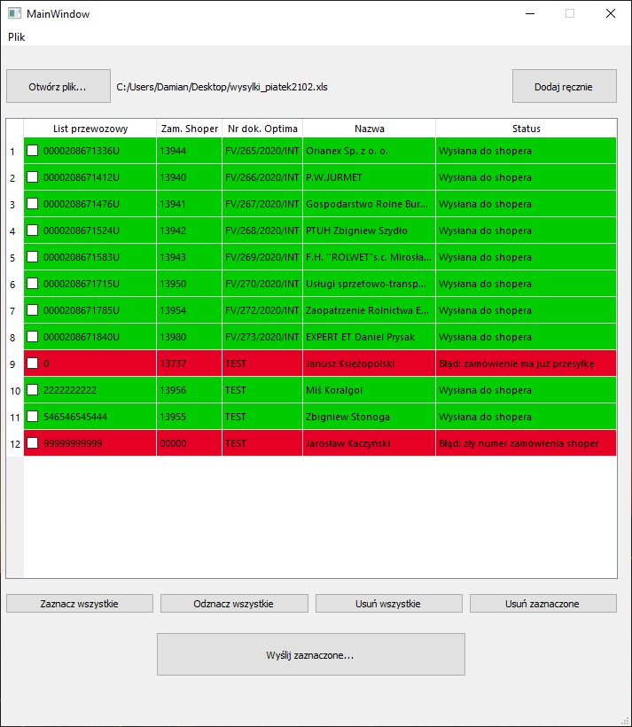

# List przewozowy - Shoper
Program służący do tworzenia przesyłek oraz przesyłania numerów listów przewozowych do sklepu internetowego opartego na platformie Shoper

### Użyte biblioteki, m.in.:
* Python 3.7
* PyQT5
* requests
* pandas (odczyt danych z pliku Excel)

### Screenshot
